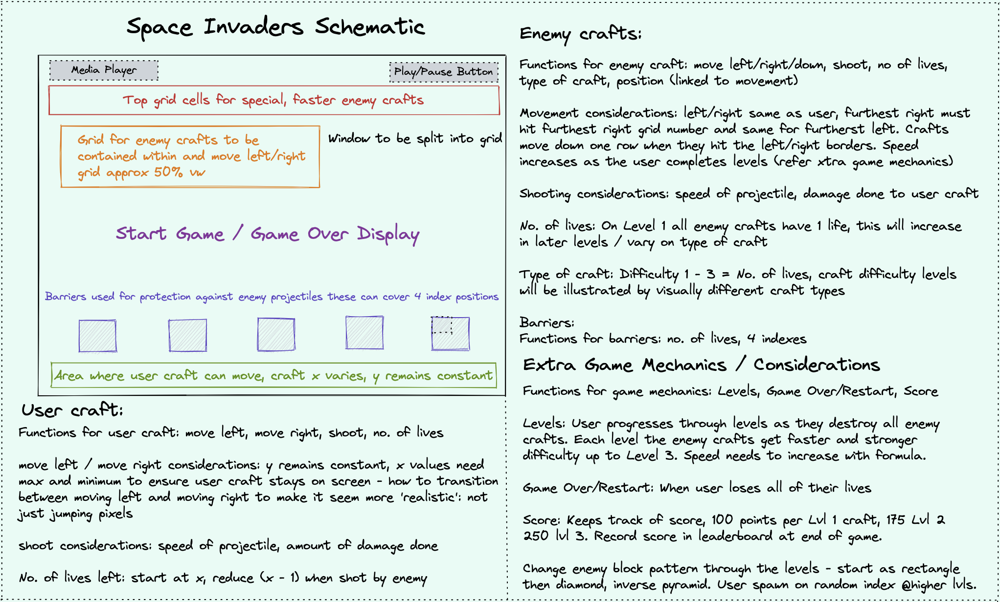

# Project Overview
The project is a browser-based version of the classic arcade game Space Invaders, created using vanilla HTML, CSS, and JavaScript. The game involves a player controlling a spaceship at the bottom of the screen and shooting down waves of alien invaders who move progressively closer to the player's position. As the player moves through levels of the game the invaders move and shoot faster.

Please find the full deployment of the app [here](https://wyndhams.github.io/ga-project-1/). 

# Brief

- Render a game in the browser
- Design logic for winning & visually display which player won
- Include separate HTML / CSS / JavaScript files
- Stick with KISS (Keep It Simple Stupid) and DRY (Don't Repeat Yourself) principles
- Use Javascript for DOM manipulation
- Deploy your game online, where the rest of the world can access it
- Use semantic markup for HTML and CSS (adhere to best practices)

## Requirements:
- The game should be playable for one player
- The obstacles should be auto generated

## Suggested enhancements:
- Different difficulty levels
- Two player mode on the same computer: players take turns the first to lose more lives across the whole game loses.
- High score board with localStorage

# Getting Started

Clone the repo locally using the SSH Key contained within the Code button above, then follow the steps below in a local Terminal window:
```
code .
```
Install the node modules:
```
npm install
```
Start the game:
```
npm start
```
# Technologies Used

- HTML5
- CSS
- JavaScript
- Git
- GitHub
- Excalidraw

# Planning
The planning phase involved determining the game's essential features, including the game's mechanics, graphics, and audio. This also included developing a roadmap and timeline to guide the project's development. I also researched different implementations of Space Invaders and played various versions of the game to better understand its core mechanics and to get inspiration for my implementation. I made sketches of the game's user interface and created a list of required assets, such as images and audio files.



# Build Process
The build process involved developing the game's mechanics using JavaScript, including the player's and alien spaceship movement, shooting and explosions. Additionally, the graphics were created using HTML and CSS. To create the audio for the game, I used a combination of sound effects from Splice.

​​To create the game, I used object-oriented programming principles. The first stage was to create a grid upon which the characters could move. I did this using the following code:

```js
function createGrid() {
    for (let i = 0; i < gridCellCount; i++) {
      const cell = document.createElement("div");
      cell.setAttribute("data-index", i);
      cells.push(cell);
      grid.appendChild(cell);
    }
  }

  createGrid();
  ```

Once the grid was created I added the user craft, enemy crafts and shields.

```js
function addEnemyCraft() {
    enemyCraftIndex.forEach((i) => cells[i].classList.add("enemyCraft"));
  }

  function addShield() {
    for (let i = 0; i < shieldIndex.length; i++) {
      cells[shieldIndex[i]].classList.add("shield");
    }
  }

  function removeEnemyCraft() {
    for (let i = 0; i < enemyCraftIndex.length; i++) {
      cells[enemyCraftIndex[i]].classList.remove("enemyCraft");
    }
  }

  // Add User Craft
  function addUserCraft() {
    cells[userCraftIndex].classList.add("userCraft");
  }

  function removeUserCraft() {
    cells[userCraftIndex].classList.remove("userCraft");
  }
```

I then worked on creating player movement which only allowed the player to track along the bottom x axis of the grid. When the player hit either side the user craft could not move any further. I achieved this by implementing an if else statement based upon the index value of the grid, which checked where the player was on the grid and if they were on the furthest right or left of the grid would not allow any additional movement, this is demonstrated in the code below:

```js
function moveUserCraft(event) {
    removeUserCraft();
    switch (event.key) {
      case "ArrowLeft":
        if (userCraftIndex % width !== 0) userCraftIndex--;
        break;
      case "ArrowRight":
        if (userCraftIndex % width < width - 1) userCraftIndex++;
        break;
    }
    addUserCraft();
  }
```

The next task was to implement the alien movement which again used conditional logic to check where the alien crafts were on the grid. This was more complicated as it involved movement in the y axis (down) and checking for multiple crafts. The aliens move along the top of the grid, drop down when they hit the right side of the screen and then move in the opposite direction until they get to the other side of the grid. I created a couple of variables to achieve this movement; a boolean that tracked whether the craft was moving left or right, and a movement variable that was altered as the aliens moved along the grid, checking the index values of the enemy craft and then using the modulus operator to determine when any of the crafts had hit the opposite side of the grid. 

```js
function moveEnemyCraft() {
    if (!mute) {
      enemyMoveSound.src = "./audio/shoot-1.wav";
      enemyMoveSound.play();
    }
    const leftSide = enemyCraftIndex.some((e) => e % width === 0);
    const rightSide = enemyCraftIndex.some((e) => e % width === width - 1);
    const landing = enemyCraftIndex.some((e) => e >= 374);
    removeEnemyCraft();
    if (rightSide && movingRight && !landing) {
      for (let i = 0; i < enemyCraftIndex.length; i++) {
        enemyCraftIndex[i] += width + 1;
        movement = -1;
        movingRight = false;
      }
    } else if (leftSide && !movingRight && !landing) {
      for (let i = 0; i < enemyCraftIndex.length; i++) {
        enemyCraftIndex[i] += width - 1;
        movement = 1;
        movingRight = true;
      }
    } else if (landing) {
      for (let i = 0; i < enemyCraftIndex.length; i++) {
        enemyCraftIndex[i];
        movement = 0;
      }
    }
    for (let i = 0; i < enemyCraftIndex.length; i++) {
      enemyCraftIndex[i] += movement;
    }
    addEnemyCraft();
  }
```

I then implemented shooting on both the player and the aliens. I did not want the player to be able to shoot an infinite number of times if they held down the z key so I used a boolean to determine how much time had passed since the prior shot had been fired. If the allowable time has elapsed the player could fire again. I also wanted random aliens to fire to add additional difficulty to the game. I implemented this using the Math.random() function.

```js
function handleKeyDown(event) {
    if (event.keyCode === 90) {
      fireUserProjectile();
      controlUserFire();
    }
  }

function fireUserProjectile() {
  controlUserFire();
  if (!userCanFire) {
    return;
  }
  shotTimer = new Date().getTime();
  userProjectiles.push(userCraftIndex);
  userCanFire = false;
  if (!mute) {
    userShootSound.src = "./audio/shoot-2.wav";
    userShootSound.play();
  }
}

let enemyProjectiles = [];
function fireEnemyProjectile() {
    if (!enemyCraftIndex.length) {
      return;
    } else {
      enemyProjectiles.push(
        enemyCraftIndex[Math.floor(Math.random() * enemyCraftIndex.length)]
      );
  }}
```

I then introduced shields in front of the user craft and collisions to the game. If the user was hit by an enemy projectile, I wanted a life to be deducted. The user started with 3 lives and if the value of lives got to 0 the end game function would be triggered which would bring up a game over screen. 

```js
function endGame() {
    if (!mute) {
      gameOverSound.src = "./audio/game-over.wav";
      gameOverSound.play();
      gameOverBoom.src = "./audio/boom.wav";
      gameOverBoom.play();
    }
    clearInterval(enemyMoveStart);
    clearInterval(projectileInterval);
    clearInterval(specialEnemyCraftMovementInterval);
    hiddenGameOver.style.display = "block";
    return (gameIsRunning = false);
  }
```

If the user hit an enemy projectile I wanted that enemy to be removed from the array of enemy crafts. Similarly if a shield were hit I wanted this to be removed from the shield array. I achieved this using the following logic.

```js
enemyProjectiles.forEach((enemyProjectileIndex) => {
      if (cells[enemyProjectileIndex].classList.contains("userCraft")) {
        userHitPlaySound();
        cells[enemyProjectileIndex].classList.remove("enemy-projectile");
        livesRemaining -= 1;
        lives.innerHTML = livesRemaining;
        cells[enemyProjectileIndex].classList.add("explosion");
        setTimeout(
          () => cells[enemyProjectileIndex].classList.remove("explosion"),
          200
        );
        if (livesRemaining === 0) {
          cells[userCraftIndex].classList.remove("userCraft");
          gameIsRunning = false;
          endGame();
        }
      } else if (cells[enemyProjectileIndex].classList.contains("shield")) {
        if (!mute) {
          boomSound.src = "./audio/shield-hit.wav";
          boomSound.play();
        }
        cells[enemyProjectileIndex].classList.remove("shield");
        enemyProjectiles = enemyProjectiles.filter(
          (i) => i !== enemyProjectileIndex
        );
        cells[enemyProjectileIndex].classList.remove("enemy-projectile");
        cells[enemyProjectileIndex].classList.add("explosion");
        setTimeout(
          () => cells[enemyProjectileIndex].classList.remove("explosion"),
          200
        );
      } else {
        cells[enemyProjectileIndex].classList.add("enemy-projectile");
      }
})
```

When the user completed a level I implemented a level up function which used intervals to increase enemy speed and enemy movement to add difficulty as the user progressed through the levels. I also iterated through a number of different enemy craft arrangements as the user progressed through the levels to add some variation. 

```js
function levelUp() {
  ...
  enemySpeed = enemySpeed - 100;
  enemyShotFrequency = enemyShotFrequency - 100;
  enemySpawnArrangementCheck();
}

function enemySpawnArrangementCheck() {
    if (currentLevel === 1 || currentLevel === 5 || currentLevel === 9) {
      enemyCraftIndex = [
        0, 1, 2, 3, 4, 5, 6, 22, 23, 24, 25, 26, 27, 28, 44, 45, 46, 47, 48, 49,
        50, 66, 67, 68, 69, 70, 71, 72, 88, 89, 90, 91, 92, 93, 94,
      ];
      if (!mute && currentLevel === 5) {
        pads.src = "./audio/pad-A.wav";
        pads.play();
      }
    } else if (
      currentLevel === 2 ||
      currentLevel === 6 ||
      currentLevel === 10
    ) {
      enemyCraftIndex = [
        0, 1, 2, 3, 4, 5, 6, 7, 8, 9, 10, 23, 24, 25, 26, 27, 28, 29, 30, 31,
        46, 47, 48, 49, 50, 51, 52, 69, 70, 71, 72, 73, 92, 93, 94, 115,
      ];
    }
    ...
}
```

The game also keeps track of the users score which increases by 100 points when the user destroys an enemy craft and 1000 points when the user hits the special enemy craft that appears once per level. I will discuss this further in the Challenges and Bugs sections as I ran out of time to implement the enemy craft functionality correctly so it is a little bit buggy in the current version of the game. 

## Styling

This was one of the aspect of the game development that I enjoyed the most. I wanted to give a classic arcade game effect so kept the crafts, shields and projectiles quite simple but added a transparency and glow effect using box-shadow to make everything look more ethereal. I implemented this using the following CSS.

```css
.userCraft {
  background-color: white;
  border-radius: 50px;
  box-shadow: inset 0 0 20px #fff, inset 20px 0 20px rgb(120, 255, 151),
    inset -20px 0 20px rgb(120, 255, 151), inset 20px 0 40px rgb(120, 255, 151),
    inset -20px 0 4px rgb(120, 255, 151), 0 0 20px #fff,
    -10px 0 40px rgb(120, 255, 151), 10px 0 40px rgb(120, 255, 151);
}
```

I also wanted to give the effect that the user was playing on a screen within their laptop / pc screen so I opted to house the game grid on a ‘tv’ in which information was displayed at the beginning of the game, at the end of levels and when the game was over due to the player losing all of their lives or the enemy craft landing. 

```css
.game-over-overlay {
  position: absolute;
  padding: 0px;
  color: rgb(255, 255, 255);
  text-align: center;
  text-shadow: rgb(255, 0, 0) 2px 2px;
  background-image: linear-gradient(
    rgba(255, 0, 0, 0.5),
    rgba(255, 140, 0, 0.3)
  );
  height: 580px;
  width: 720px;
  border-radius: 25px;
  -webkit-box-shadow: inset 0px 0px 5em 0px var(--glow-color),
    0px 0px 0.7em 0px var(--glow-color);
  -moz-box-shadow: inset 0px 0px 5em 0px var(--glow-color),
    0px 0px 0.7em 0px var(--glow-color);
  box-shadow: inset 0px 0px 5em 0px var(--glow-color),
    0px 0px .5em 0px var(--glow-color);
}
```

I was also proud of the two orbs which appear either side of the ‘tv’ screen. I created these from scratch using CSS with animation triggered by the enemy shot. I also added some responsive design by removing them for smaller screens.

```css
.orb1 {
  position: absolute;
  top: calc(62%);
  right: 40px;
  width: 180px;
  height: 180px;
  border-radius: 50%;
  box-shadow: inset 0 0 50px #fff, inset 20px 0 80px rgb(144, 0, 255),
    inset -20px 0 80px #0ff, inset 20px 0 180px rgb(144, 0, 255),
    inset -20px 0 180px #b9fbff, 0 0 50px #fff, -10px 0 80px rgb(144, 0, 255),
    10px 0 80px #b9fbff;
}

@media (max-width: 1240px) {
  .orb1 {
    display: none;
  }
  .orb2 {
    display: none;
  }
}

@keyframes shake {
  10%, 90% {
    transform: translate3d(-1px, 0, 0);
  }
  
  20%, 80% {
    transform: translate3d(2px, 0, 0);
  }

  30%, 50%, 70% {
    transform: translate3d(-2px, 0, 0);
  }

  40%, 60% {
    transform: translate3d(2px, 0, 0);
  }
}
```

# Challenges
One of the primary challenges of the project was achieving smooth and responsive movement for the player's spaceship and the alien invaders, while also maintaining consistent gameplay performance. Achieving this required careful optimisation of the code. This could still be smoother and is something I would like to improve through further development.

Another challenge was making the game compatible with a wide range of browsers and devices. Since the game was developed using vanilla HTML, CSS, and JavaScript, it was important to ensure that it could run on as many platforms as possible. This required thorough testing and debugging across different browsers, including legacy browsers that may not support the latest web standards. It also required designing the game to be responsive and scalable across different screen sizes and resolutions.

A further challenge was creating the game's audio, as it required knowledge of digital audio editing and manipulation, as well as using the Web Audio API to handle playback and control of the audio in the game. Balancing the audio levels and creating the right sound effects for the game required careful attention to detail and iteration.

Finally, creating the high-score tracking system required understanding of how to save and retrieve data from the browser's local storage, as well as designing a simple and intuitive user interface to display the player's score and progress.

# Highlights & Key Takeaways
The highlights of the project include the successful implementation of the game's mechanics, graphics, and audio, resulting in a fully functional Space Invaders game. I was also proud of the implementation of the different difficulty levels in the game.

Another significant highlight of the project was creating a responsive and intuitive user interface. The game's interface includes a start screen with instructions, a game screen with the player's score and remaining lives, and an end screen with the player's final score and an option to restart the game.

Another highlight was the development process itself. Working on the project allowed me to deepen my understanding of core programming concepts such as object-oriented programming, game mechanics, and algorithm optimisation. I also gained experience with project management and design, as well as working with external libraries and APIs.

# Future Development
If I had more time I would like to include some additional features to the game and also improve certain aspects of it. I have included a list below of such changes:
- Optimisation to improve performance on a wider range of devices, including making the game mobile friendly with additional responsive design.
- Adding power-ups: Power-ups such as shields, extra lives, and weapon upgrades could be introduced to add variety and strategic depth to the game.
- Adding boss battles: Boss battles could be included as a climactic finale to each level, requiring the player to use different tactics and skills to defeat a tougher opponent.
- Expanding the game world: The game could be expanded to include more levels, enemy types, and environments, such as different planets or space stations.
- Improving graphics and audio: The game's graphics and audio could be improved to enhance the game's atmosphere and to make it more visually appealing and immersive. This could involve creating more detailed and animated characters, and adding more varied and dynamic music and sound effects.

# Bugs
- The interval on the special enemy craft needs refining. This works correctly on Level 1, i.e. the craft appears after 'x' seconds. However each of the proceeding levels the craft appears straight away. 
- The user can still shoot when in the lobby waiting between levels.
- The restart function works by reloading the page rather than resetting all of the intervals, score etc. 
